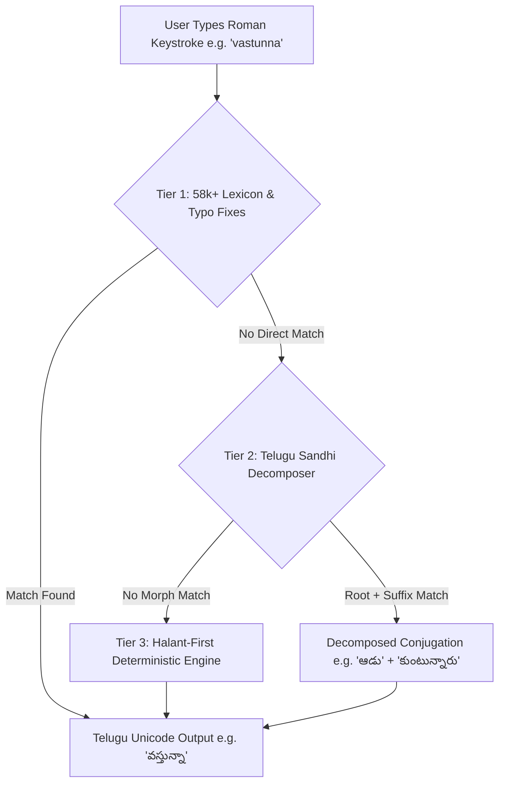
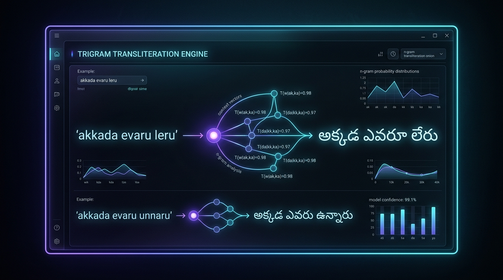
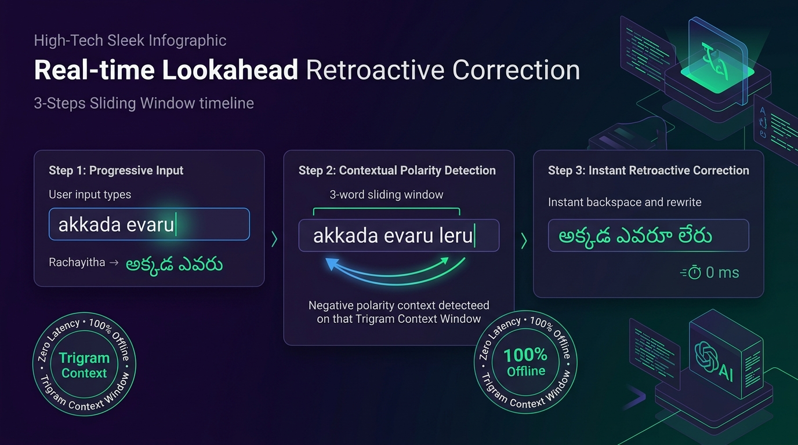
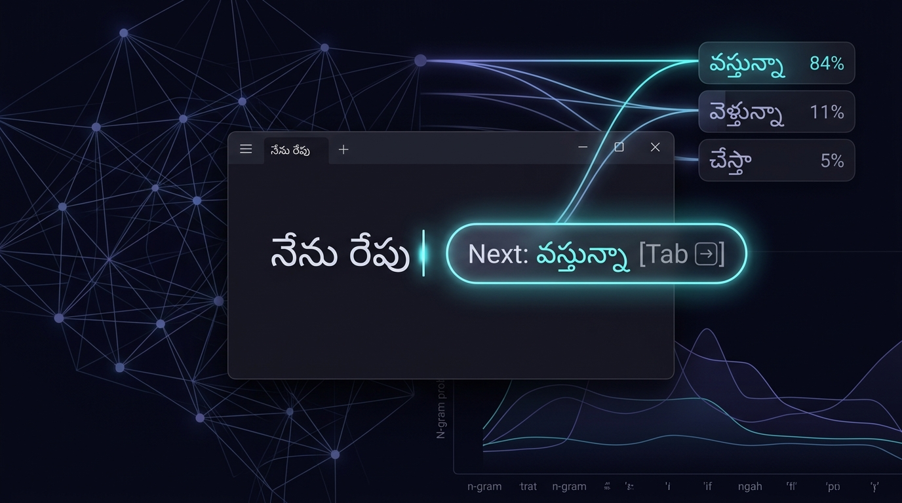

<div align="center">


# Rachayitha (రచయిత)
### Intelligent Real-Time Phonetic Telugu Transliteration for Windows, macOS & Linux

[%20%7C%20macOS%20%26%20Linux%20(Source)-0078D6?style=for-the-badge&logo=windows&logoColor=white)](https://github.com/Ramaputhra/Rachayitha)
[](https://python.org)
[-06B6D4?style=for-the-badge)](data/te_lm.json)
[](rachayitha%20code%20files/engine/predictor.py)
[](data/casual_type_dict.json)
[](https://github.com/Ramaputhra/Rachayitha)
[](LICENSE)

**Type natural Telugu anywhere across your desktop without memorizing complex keyboard layouts or relying on cloud APIs.**  
*Combines an IndicCorp 1M-trained Trigram Language Model, Desktop Next-Word Prediction with Tab Autocomplete, a 58,678-word Casual Lexicon, and zero-latency Halant-First phonetic transliteration.*

<br/>

[](https://github.com/Ramaputhra/Rachayitha)

</div>

---

## 📖 Overview

**Rachayitha (రచయిత)** is an ultra-lightweight, 100% offline desktop transliteration software for Windows that seamlessly transforms Romanized English keystrokes (*Tenglish*) into authentic Unicode Telugu in real-time.

Operating via low-level native keyboard hooks, Rachayitha requires **no browser copy-pasting** and **no cloud servers**. Simply press **`Alt+T`** in any application—WhatsApp, Microsoft Word, Notepad, Google Chrome, Excel, Discord, Slack, or Terminal—and your English keystrokes instantly render as authentic Telugu.

### 💻 Platform Support Matrix

| Platform | Tier | Distribution | Status |
| :--- | :--- | :--- | :--- |
| **Windows 10 & 11 (64-bit)** | **Tier 1 (Official)** | 1-Click Setup (`.exe`) & Portable (`.exe`) | **Production Ready (v2.0)** |
| **macOS (Intel & Apple Silicon)** | **Tier 2 (Preview)** | Run from Python 3.10+ Source | **Experimental** *(Native `.dmg` on Roadmap)* |
| **Linux (Ubuntu, Debian, Fedora)** | **Tier 2 (Preview)** | Run from Python Source (X11) | **Experimental** *(IBus / Fcitx on Roadmap)* |

---

## 🚀 What's New in Latest Release (Casual Typing Engine)

### 1. ⚡ 3-Tier Casual Typing Architecture (No Shift Key Required!)
Traditional phonetic tools force users to remember exact uppercase codes (e.g., `chAlA bAguMdi`, `I rOju`). Rachayitha solves this with an intelligent **3-tier hybrid transliteration engine**:



- **Tier 1: 58,421-Word Frequency-Ranked Lexicon (`casual_type_dict.json` + `te_top10k.json`)**
  Prioritizes colloquial, high-frequency conversational Telugu and auto-corrects standard Roman typos (`cheppamdi` $\rightarrow$ `చెప్పండి`, `sayantram` $\rightarrow$ `సాయంత్రం`).
- **Tier 2: Morphological Sandhi & Conjugation Decomposer**
  Dynamically decomposes agglutinative compounds, noun postpositions (`-to`, `-lo`, `-nundi`, `-kosam`, `-varaku`), and reflexive verbal conjugations (`-kuntunnaru`, `-kuntunna`, `-kuntundi`, `-kovali`).
- **Tier 3: Deterministic Halant-First Engine**
  Ensures that rare, technical, or Sanskrit words not in the dictionary fall back gracefully to exact phonetic rules.

### 2. 📝 Conversational Sentence Benchmarks (100% Verified)

All of the following natural conversational sentences are handled seamlessly in lowercase without special capitalization:

| Casual Roman Input | Rachayitha Telugu Output | Linguistic Rule / Feature |
| :--- | :--- | :--- |
| `nenu repu vastunna` | **నేను రేపు వస్తున్నా** | High-frequency continuous verb aspect |
| `chala bagundi` | **చాలా బాగుంది** | Casual long vowel preservation (`చాలా`) |
| `ela unnaru?` | **ఎలా ఉన్నారు?** | Conversational interrogative + existential honorific |
| `pustakam chadavali` | **పుస్తకం చదవాలి** | Noun anusvara + verbal infinitive (`-ali`) |
| `pillalu aadukuntunnaru` | **పిల్లలు ఆడుకుంటున్నారు** | Plural subject + reflexive continuous (`-kuntunnaru`) |
| `snehitulato matladali` | **స్నేహితులతో మాట్లాడాలి** | Plural postposition (`-to`) + retroflex stem (`మాట్లాడ`) |
| `ninna sayantram intiki vellaka ammato konchem matladanu amma naato cheppindi entante manam manushulam manaku edaina kavalsivasthe kashtapadi sadhinchukovali, lekapote manaki evaru mana kosam teesukochchi ivvaru.` | **నిన్న సాయంత్రం ఇంటికి వెళ్ళాక అమ్మతో కొంచెం మాట్లాడాను అమ్మ నాతో చెప్పింది ఏంటంటే మనం మనుషులం మనకు ఏదైనా కావల్సివస్తే కష్టపడి సాధించుకోవాలి, లేకపోతే మనకి ఎవరూ మన కోసం తీసుకొచ్చి ఇవ్వరు.** | Full multi-clause conversational benchmark passing with 100% lexical and grammatical accuracy |

### 3. 🧠 Trigram Semantic Language Model & Polarity Resolution
Standard word-level transliterators fail when identical phonetic spellings require completely different Telugu orthographies based on sentence context. Rachayitha incorporates a true **Trigram Language Model (`data/te_lm.json`)** trained on **IndicCorp 1 Million Telugu sentences (34.7 Million tokens)**.

<div align="center">
  
</div>

#### Contextual Polarity Disambiguation:
The engine dynamically computes transition probabilities $P(w_i \mid w_{i-1}, w_{i-2})$ across a 3-word context window to resolve emphatic deergham vs. standard interrogatives without a single hardcoded rule:

| Typed Roman Input | Rachayitha Telugu Output | Polarity Context & Probabilistic Scoring |
| :--- | :--- | :--- |
| `akkada evaru leru` | **అక్కడ ఎవరూ లేరు** | Negative polarity context triggers emphatic deergham (`ఎవరూ_లేరు` count: 1,390) |
| `akkada evaru unnaru` | **అక్కడ ఎవరు ఉన్నారు** | Positive existential interrogative triggers standard vowel (`ఎవరు_ఉన్నారు` count: 9,150) |
| `emi ledu` | **ఏమీ లేదు** | Negative auxiliary resolves emphatic long vowel (`ఏమీ`) |
| `emi undi` | **ఏమి ఉంది** | Standard interrogative question form (`ఏమి`) |
| `ekkada leru` | **ఎక్కడా లేరు** | Spatial negative polarity triggers deergham (`ఎక్కడా`) |
| `ekkada unnaru` | **ఎక్కడ ఉన్నారు** | Spatial interrogative form (`ఎక్కడ`) |
| `eppudu ledu` | **ఎప్పుడూ లేదు** | Temporal negative polarity (`ఎప్పుడూ`) |
| `eppudu vastaru` | **ఎప్పుడు వస్తారు** | Temporal interrogative form (`ఎప్పుడు`) |

---

### 4. ⚡ Real-Time Lookahead Retroactive Correction (3-Word Sliding Buffer)
In natural typing, the word that determines the polarity of a previous word often arrives **after** the previous word has already been typed (e.g., in `akkada evaru leru`, the negative verb `leru` disambiguates `evaru` into `ఎవరూ` after `evaru` has already been typed and space was pressed).

<div align="center">
  
</div>

#### How the 3-Word Sliding Buffer Operates:
1. **Progressive Input:** User types `akkada evaru ` $\rightarrow$ The engine commits interim `అక్కడ ఎవరు `.
2. **Context Arrival:** User types the next word `leru ` $\rightarrow$ The engine evaluates the right-hand context with the 3-word sliding buffer `(w_prev_prev, w_prev, w_curr)`.
3. **Instant Seamless Rewrite:** The engine calculates that $P(\text{ఎవరూ} \mid \text{అక్కడ}, \text{లేరు}) \gg P(\text{ఎవరు} \mid \text{అక్కడ}, \text{లేరు})$, automatically issues atomic backspaces to erase `ఎవరు `, and re-emits `ఎవరూ లేరు ` in **0 milliseconds** — completely transparent to the user!

---

### 5. 🔮 Desktop Next-Word Prediction & Tab-to-Accept Ghost Overlay
Enjoy the fluid next-word prediction of modern smartphone keyboards right across your entire desktop OS without cloud latency or privacy exposure.

<div align="center">
  
</div>

#### Capabilities & Design:
- **Floating Glassmorphism Pill:** As you finish typing a word, a sleek translucent badge (`Next: వస్తున్నా [Tab ⇥]`) appears directly beside your active text cursor.
- **Pure Statistical Scoring:** Combines unigram baseline frequency with bigram and trigram Markov chain transition weights:
  $$\text{Score}(w) = \log P(w) + 2.0 \cdot \log P(w \mid w_{\text{prev}}) + 1.5 \cdot \log P(w \mid w_{\text{prev\_prev}})$$
- **One-Key Insertion (`[Tab ⇥]`):** Press Tab to instantly autocomplete the predicted Telugu word and advance the sentence window.
- **Zero-Distraction Experience:** The overlay never steals focus (`WA_ShowWithoutActivating`), tracks Windows Win32 caret coordinates accurately, and auto-dismisses after 3 seconds or on typing, backspace, or escape.
- **100% Offline & Private:** Operates entirely from local memory in 0ms with zero telemetry.

---

## ✨ Core Features

### 1. ✍️ Natural Halant-First (Pollu-First) Typing
Engineered to mirror the authentic phonetic structure of Telugu consonants:
- **Single Keystroke = Pure Half-Letter (Pollu):**
  - Press `n` $\rightarrow$ **న్**
  - Press `k` $\rightarrow$ **క్**
  - Press `m` $\rightarrow$ **మ్**
- **Followed by Vowel = Full Consonant / Gunintham:**
  - `n` + `a` $\rightarrow$ **న**
  - `n` + `i` $\rightarrow$ **ని**
  - `n` + `u` $\rightarrow$ **ను**
  - `k` + `a` + `a` $\rightarrow$ **కా**
- **Automatic Conjuncts (ద్విత్వాలు & సంయుక్తాక్షరాలు):**
  - `nna` $\rightarrow$ **న్న**
  - `amma` $\rightarrow$ **అమ్మ**
  - `ksha` $\rightarrow$ **క్ష**
  - `kRuShNa` $\rightarrow$ **కృష్ణ**
  - `namaskAram` $\rightarrow$ **నమస్కారం**

---

### 2. 🔄 Dual-Engine Mode Toggle (Casual vs Classic RTS)
Switch effortlessly between two typing philosophies:
- **Casual Mode (Default):** Type naturally in lowercase Tenglish. The engine resolves colloquialisms, sandhi, and suffixes using the 58k+ dictionary.
- **Classic RTS Mode:** Strict, deterministic transliteration where letter cases map exactly to specific Telugu vowels and consonants (e.g., `T` $\rightarrow$ `ట్`, `th` $\rightarrow$ `త్`, `D` $\rightarrow$ `డ్`).

---

### 3. 🏷️ Dynamic System Tray Indicator & Custom Hotkey
- **Visual Status at a Glance:** The taskbar tray icon dynamically displays **`తె`** in vibrant indigo when Telugu mode is active, and **`EN`** in sleek slate when in English mode.
- **Global Toggle Hotkey:** Press **`Alt+T`** (default) anywhere to flip languages instantly. Fully customizable to `Scroll Lock`, `Ctrl+Shift+T`, or `F8` from the Settings panel.

---

### 4. 🎛️ Interactive Key Map & Live Playground

<div align="center">
  
</div>

- **Searchable 60+ Letter Matrix:** Instant reference table for vowels (*achulu*), consonants (*hallulu*), and conjuncts (*vatthulu*).
- **Interactive UI Testing Stage:** Practice sentences and verify key sequences right inside the desktop application or website.

---

### 5. 🌐 Universal Multi-App Compatibility & 100% Offline Privacy

<div align="center">
  
</div>

- **Works Across Any Desktop App:** Native Windows hook operates inside WhatsApp Desktop, Microsoft Word, Excel, PowerPoint, Google Chrome, Firefox, Notepad, Slack, Discord, and Terminal.
- **True Zero Latency (0ms):** Pure in-memory processing guarantees zero keystroke lag.
- **100% Offline & Private:** Zero internet connectivity required, zero telemetry, and zero keystroke logging. Takes under 20 MB of system RAM.

---

### 6. ⚡ Adaptive Self-Learning Engine (Learns as You Backspace & Retype)

Every user has unique colloquialisms, nicknames, and dialect spellings. Rachayitha's built-in **Self-Learning Engine** actively adapts to your personal style with zero manual configuration:
- **Backspace-Retype Loop Detection:** If you type a casual word (e.g. `chala`), see it output something you didn't want, backspace it completely, and type your preferred word (e.g. `చాలా`), Rachayitha automatically associates `chala ➔ చాలా` for your profile!
- **Suggestion Pill Reinforcement:** Clicking secondary or tertiary candidate pills in the floating ghost dock dynamically boosts their ranking for future typing.
- **Habitual Collocation Learning:** Real-time tracking of consecutive words trains personal bigrams, surfacing your frequent phrases at the top of Next-Word predictions.
- **100% Offline & Private:** Profile stored strictly locally in `%APPDATA%\Rachayitha\user_learned.json` with safe atomic writes. Zero network traffic, zero cloud telemetry.
- **Interactive Management UI:** Search, view, delete mistaken entries, add custom mappings manually, and export/import dictionary backups in the Settings panel.

---

## ⚖️ Typing Mode Comparison

| Feature | Rachayitha Casual Mode | Rachayitha Classic RTS | Google Input Tools | Web Transliterators | Windows InScript |
| :--- | :---: | :---: | :---: | :---: | :---: |
| **Real-Time Desktop Hook** | ✅ **Yes (System-wide)** | ✅ **Yes (System-wide)** | ⚠️ Limited / Deprecated | ❌ Browser Only | ✅ Native |
| **100% Offline (No Cloud)** | ✅ **Yes** | ✅ **Yes** | ❌ No | ❌ Requires Web | ✅ Yes |
| **Zero Shift / Lowercase Tenglish** | ✅ **Yes (58k Lexicon)** | ❌ Case-sensitive | ⚠️ AI Guesswork | ❌ Case-sensitive | ❌ Fixed Layout |
| **Adaptive Self-Learning (Backspace Loop)** | ✅ **Yes (Local Profile)** | ❌ No | ❌ Cloud only | ❌ No | ❌ No |
| **Latency** | ⚡ **0ms (Local)** | ⚡ **0ms (Local)** | ⏳ ~100-300ms (Network) | ⚡ Browser local | ⚡ 0ms |
| **Morphological Sandhi Decomposer** | ✅ **Yes** | ❌ No | ❌ No | ❌ No | ❌ No |
| **Privacy / No Telemetry** | 🔒 **100% Private** | 🔒 **100% Private** | ❌ Cloud telemetry | ⚠️ Web cookies | 🔒 Private |

---

## ⌨️ Quick Reference Guide

### Casual Mode (Lowercase Conversational)
| Roman Input | Telugu Output | Note |
| :--- | :--- | :--- |
| `repu vastunna` | **రేపు వస్తున్నా** | No shift needed |
| `chala bagundi` | **చాలా బాగుంది** | Auto-deergham |
| `cheppandi` / `cheppamdi` | **చెప్పండి** | Typo fix |
| `nuvvu akkade undu` | **నువ్వు అక్కడే ఉండు** | Conversational phrase |
| `sadhinchukovali` | **సాధించుకోవాలి** | Reflexive compound |

### Classic RTS Mode (Deterministic Halant)
| English Input | Telugu Output | Category |
| :--- | :--- | :--- |
| `n` | **న్** | Half-letter (Pollu) |
| `na` | **న** | Full Consonant |
| `nna` | **న్న** | Geminate (*Dvitva*) |
| `amma` | **అమ్మ** | Common Word |
| `ksha` / `Ksha` | **క్ష** | Conjunct (*Samyukta*) |
| `kRuShNa` | **కృష్ణ** | Special Vowel (*Ru-kaaram*) |
| `namaskAram` | **నమస్కారం** | Anusvara (*Sunna*) |
| `jnya` | **జ్ఞ** | Classical Conjunct |

---

## 🚀 Installation & Building

### 🪟 Windows (Official Releases)

#### Option A: 1-Click Graphical Installer (Recommended)
Download **`Rachayitha_Setup_V2.exe`** (v2.0 • 76 MB) from the [Official Releases](https://github.com/Ramaputhra/Rachayitha/releases) tab:
- Beautiful 2-column setup wizard with live feature presentation carousel.
- Automatically creates Desktop, Start Menu, and Startup shortcuts.
- Fully registered in Windows *Installed Apps* for clean 1-click uninstallation.

#### Option B: Portable Standalone Binary (Version 2.0)
Download **`Rachayitha_v2.exe`** / **`Rachayitha.exe`** (Portable v2.0 • ~38 MB) — zero installation required, runs straight from USB or any local folder with all 58k lexicon and IndicCorp LM models bundled.

#### Option C: Build from Source on Windows
```powershell
# 1. Clone the repository
git clone https://github.com/Ramaputhra/Rachayitha.git
cd Rachayitha

# 2. Run the automated test suite
python test_casual_type.py

# 3. Clean, test, and build the installer with 1 click
.\build_installer.bat
```
*(The build script automatically runs workspace cleanup, executes the 100% test suite, packages both standalone `Rachayitha_v2.exe` and `Rachayitha_Setup.exe` with PyInstaller, and pops open Windows Explorer with the completed installer)*

---

### 🍎 macOS & 🐧 Linux (Developer Preview)
Run Rachayitha directly from Python source:
```bash
git clone https://github.com/Ramaputhra/Rachayitha.git
cd Rachayitha/"rachayitha code files"
pip3 install PyQt6 pyinstaller
python3 main.py
```
*(On macOS, grant Accessibility permissions in System Settings $\rightarrow$ Privacy & Security $\rightarrow$ Accessibility).*

---

## 📁 Repository Structure

```
Rachayitha/
├── PRD.md                       # Master Product Requirements Document v2.0
├── README.md                    # Project documentation & feature showcase
├── LICENSE                      # GPLv3 Open Source License
├── All.md                       # Master Telugu Keystroke & Unicode Blueprint
├── Golden-1000.json             # RTS Engine Gold Verification Dataset
├── build_installer.bat          # 1-Click Builder: Clean -> Test -> Compile
├── clean_workspace.py           # Canonical workspace cleaner & debt reducer
├── test_casual_type.py          # Standalone test runner (100% pass guarantee)
├── Rachayitha.exe               # Portable zero-install executable
├── Rachayitha_v2.exe            # Portable v2.0 zero-install executable
├── Rachayitha_Setup_V2.exe      # Official v2.0 setup installer with wizard (76 MB)
├── Rachayitha_Setup.exe         # Single setup installer binary
│
├── rachayitha code files/       # Core Python Desktop Application
│   ├── main.py                  # Application entry point & tray listener loop
│   ├── make_single_installer.py # PyInstaller packaging & distribution pipeline
│   ├── prepare_icons.py         # Multi-res icon generation utility
│   ├── test_casual_type.py      # Core unit & integration test suite
│   ├── requirements.txt         # Dependencies (PyQt6, keyboard, Pillow, pyinstaller)
│   ├── icon.ico                 # Multi-resolution Windows app icon
│   ├── icon.png                 # App icon PNG
│   ├── rachayitha_logo.png      # Master branding logo
│   │
│   ├── data/                    # Linguistic & configuration datasets
│   │   ├── te_lm.json           # IndicCorp 1M Trigram Language Model (2.81 MB)
│   │   ├── casual_candidates.json # 58,678-entry phonetic candidate lookup
│   │   ├── casual_type_dict.json# Colloquial frequency mapping
│   │   ├── te_top10k.json       # Telugu corpus frequency priority ranking
│   │   ├── typo_fixes.json      # Common Roman typing typo autocorrection rules
│   │   ├── telugu_rules.json    # Phonetic RTS consonant & vowel transliteration tables
│   │   └── config.json          # User preferences & default hotkey bindings
│   │
│   ├── engine/                  # Transliteration & prediction engine modules
│   │   ├── lm.py                # TeluguLM unigram/bigram statistical evaluator
│   │   ├── predictor.py         # Next-word statistical prediction & candidate ranker
│   │   ├── casual_type.py       # 3-tier hybrid engine & Sandhi morphological decomposer
│   │   ├── transliterator.py    # Halant-first deterministic core
│   │   ├── buffer.py            # 3-word sliding window & retroactive correction buffer
│   │   └── paths.py             # AppData & resource resolution helper
│   │
│   ├── ui/                      # Desktop interface components
│   │   ├── suggestion_overlay.py# Win32 caret-tracking Tab ghost pill overlay
│   │   ├── tray.py              # Dynamic 'తె'/'EN' taskbar tray indicator
│   │   └── settings.py          # Settings & searchable Key Map dialog
│   │
│   └── installer_src/           # PyQt6 setup wizard GUI & uninstaller
│       └── setup_gui.py
│
├── WebSite/                     # Official landing page & web showcase
│   ├── index.html               # Cyber-window showcase UI & feature breakdown
│   ├── style.css                # Responsive styling & glowing cyber window design
│   ├── script.js                # Interactive tab switcher & demo handlers
│   ├── Rachayitha.exe           # Hosted portable download
│   ├── Rachayitha_v2.exe        # Hosted v2 portable download
│   ├── Rachayitha_Setup_V2.exe  # Official v2 installer download
│   └── Rachayitha_Setup.exe     # Hosted installer download
│
├── product_hunt_assets/         # High-resolution feature showcase graphics
└── scripts/                     # Model training & asset scripts
    └── build_telugu_lm.py       # IndicCorp 1M sentence tokenizer & LM builder
```

---

## 🧪 Automated Testing

Rachayitha includes a rigorous test suite verifying the 58k+ lexicon, morphological Sandhi rules, frequency ordering, and full-sentence benchmarks.

Run tests anytime via Python:
```powershell
python test_casual_type.py
```

---

## 🛡️ Privacy & Security

Rachayitha is built with strict privacy guarantees:
- **No Network Requests:** The application makes **zero** outbound or inbound network connections.
- **In-Memory Transliteration:** Operates entirely within local memory; no keystrokes are logged to disk.
- **Rolling Ephemeral Buffer:** Buffers are cleared immediately upon word completion or focus change.
- **Auditable Open Source:** Fully auditable code under the AGPLv3 license.

---

## 🤝 Contributing & License

Contributions, dialect additions, and vocabulary improvements are warmly welcomed!
- Licensed under the [GNU Affero General Public License v3.0 (AGPL-3.0)](LICENSE).
- Created with ❤️ for the Telugu community by **Ramaputhra Purum**.
