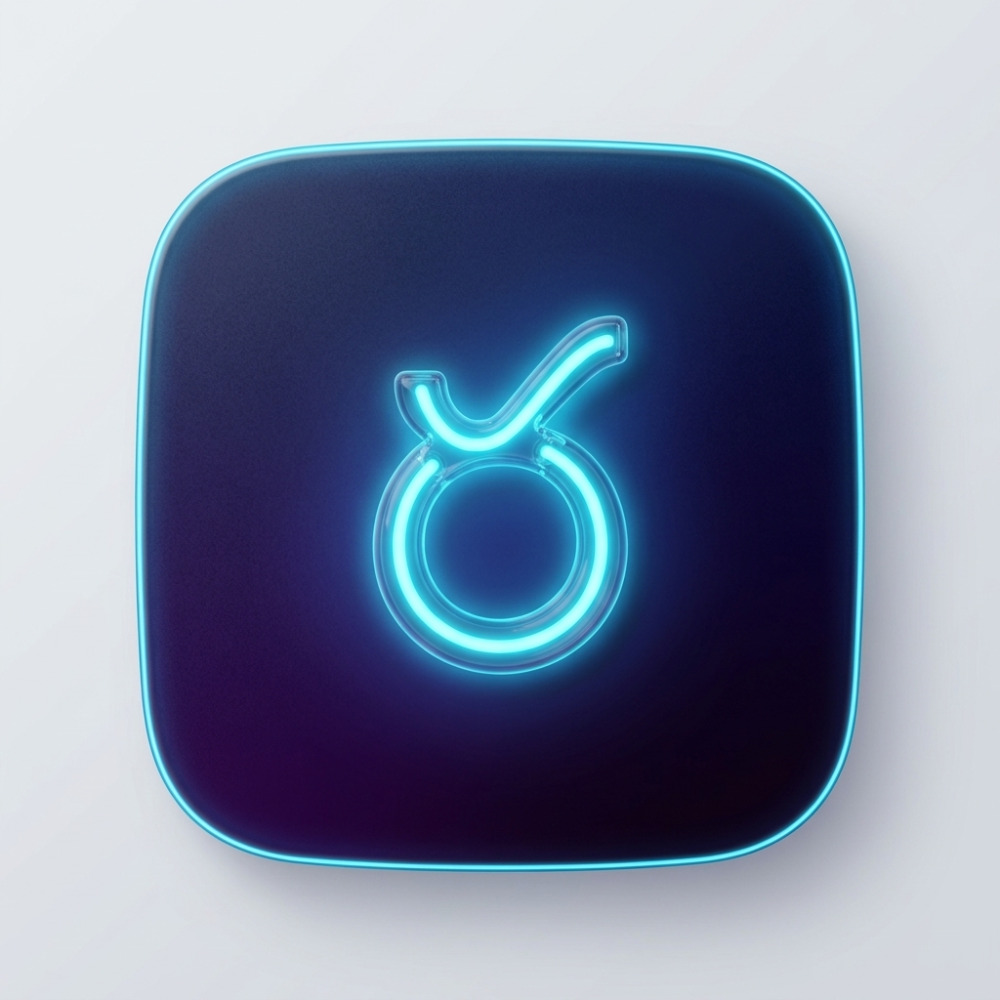
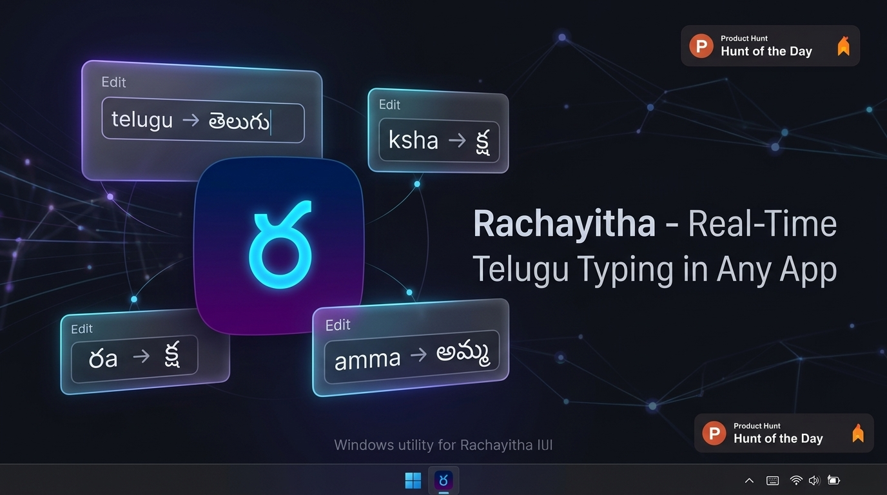
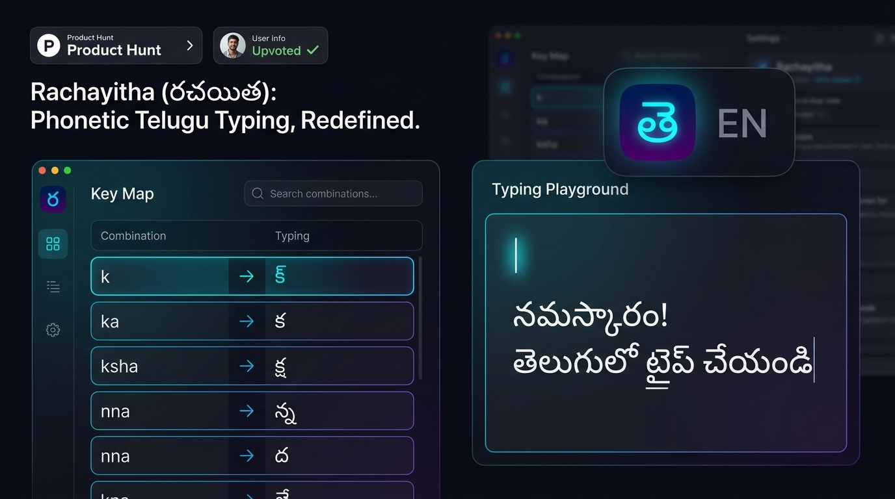
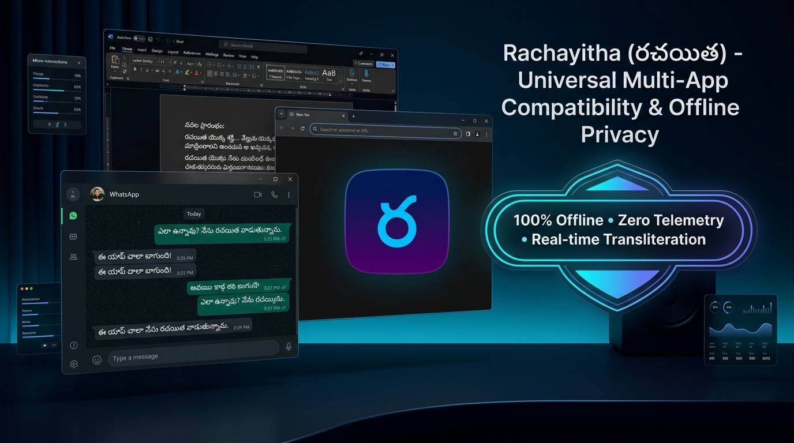

<div align="center">



# Rachayitha (రచయిత) Source Code
### Real-Time Phonetic Telugu Transliteration Engine & Windows Desktop App

[](https://github.com)
[](https://python.org)
[](https://github)

<br/>

[](https://github)

</div>

---

## 🛠️ Developer Quick Start

### 1. Run from Source
```powershell
python main.py
```

### 2. Build the Standalone Single Installer (`Rachayitha_Setup.exe`)
```powershell
python make_single_installer.py
```
*Generated output:* `installer_output\Rachayitha_Setup.exe`

### 3. Build the Standalone Portable App (`Rachayitha.exe`)
```powershell
.\build_standalone.bat
```
*Generated output:* `dist\Rachayitha.exe`

### 4. Direct 1-Click System Install (Windows)
```powershell
.\Install_Rachayitha.bat
```

### 5. Build on macOS (`.app` & `.dmg`)
```bash
# Convert logo to ICNS
mkdir -p Rachayitha.iconset
sips -z 512 512 rachayitha_logo.png --out Rachayitha.iconset/icon_512x512.png
iconutil -c icns Rachayitha.iconset -o icon.icns

# Build .app and .dmg
pyinstaller --noconfirm --onedir --windowed --name "Rachayitha" --icon="icon.icns" --add-data "data:data" main.py
hdiutil create -volname "Rachayitha" -srcfolder dist/Rachayitha.app -ov -format UDZO dist/Rachayitha.dmg
```

---

## 📸 Interface & Capabilities

<div align="center">
  
  <br/><br/>
  
</div>

---

## 📁 Architecture

- **`engine/transliterator.py`**: Lekhini RTS + Halant-first rule processor.
- **`engine/buffer.py`**: Rolling ring buffer capturing keystrokes and dispatching backspaces + Telugu Unicode strings.
- **`ui/settings.py`**: PyQt6 settings interface with searchable 60+ letter Key Map and live playground.
- **`ui/tray.py`**: Taskbar system tray icon rendering dynamic `తె` and `EN` badges.
- **`installer_src/`**: Setup wizard with feature presentation carousel and Windows uninstaller.
